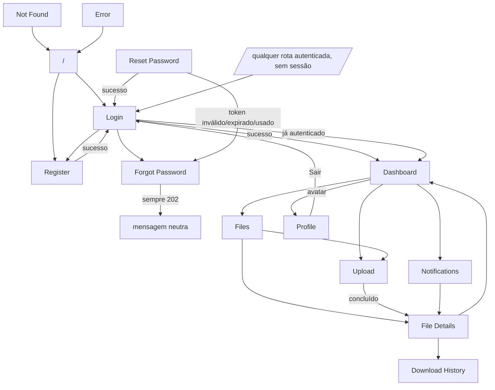
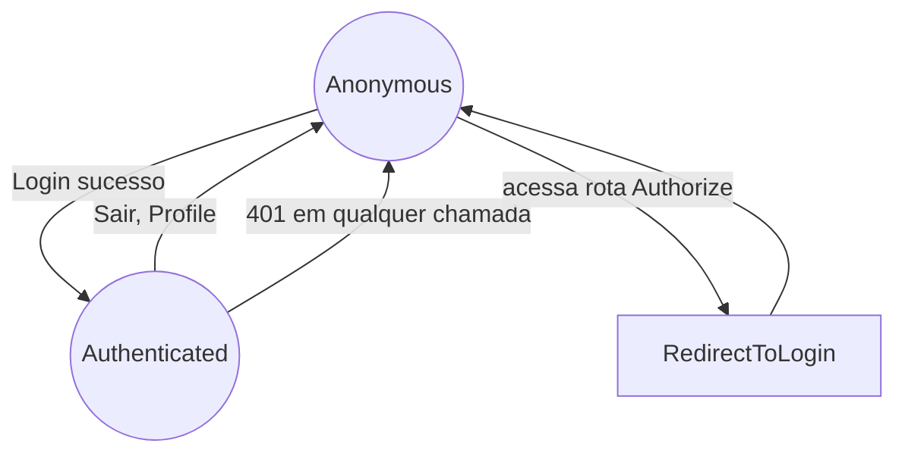
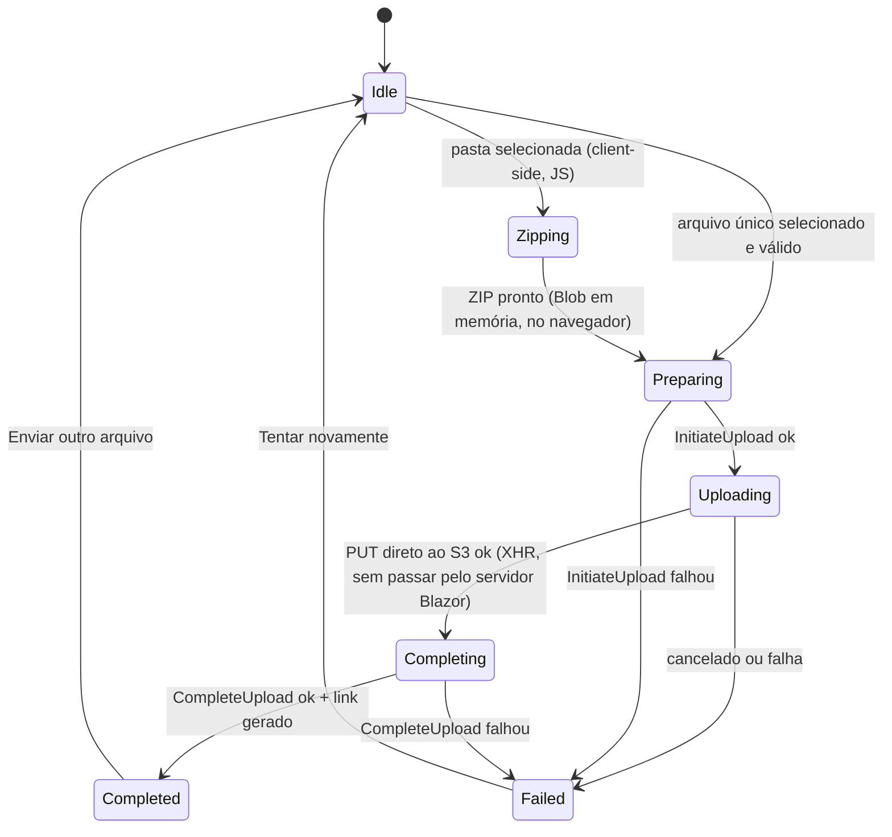
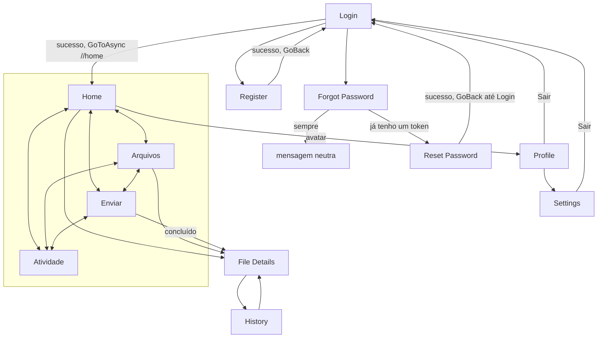
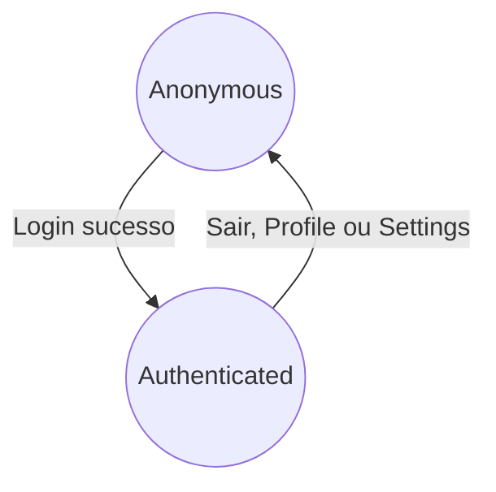
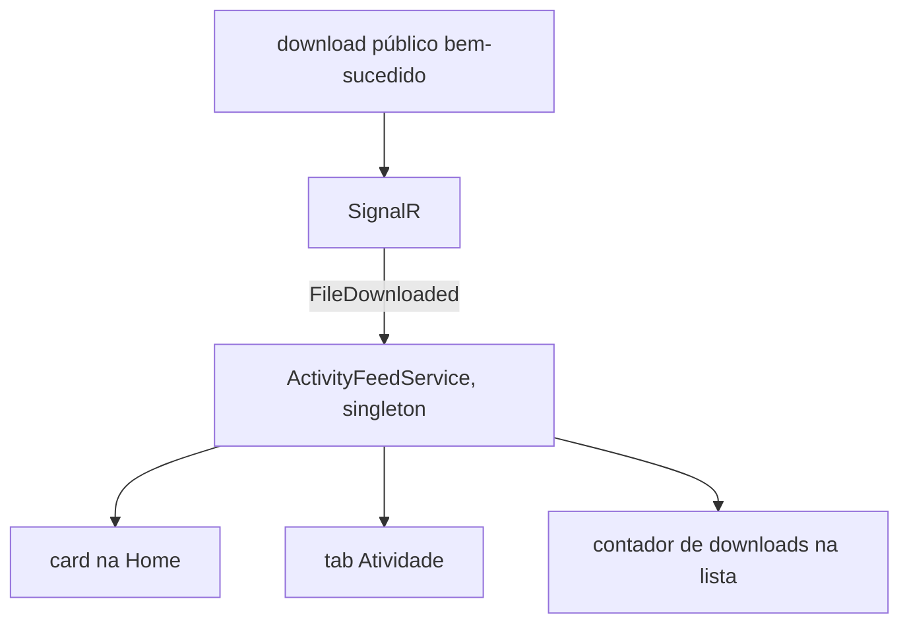
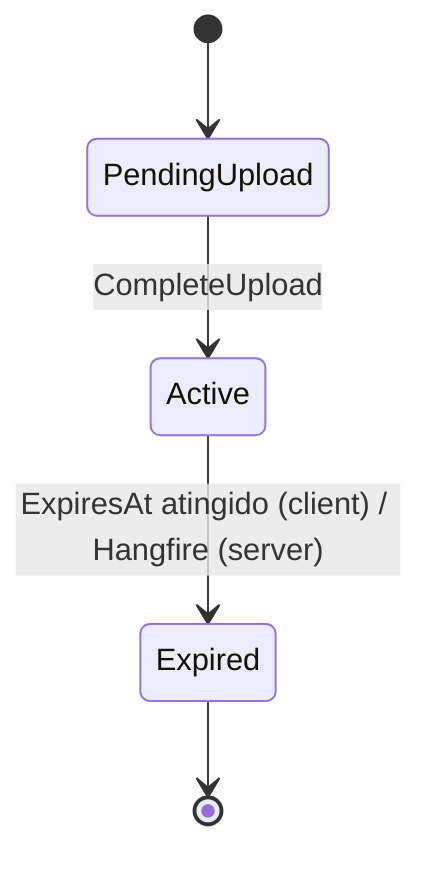

# Navigation Flows

Mapeamento completo do produto FileSharing (Web + Mobile) — telas, rotas, transições e estados —
produzido a partir da inspeção real do código após a implementação. Onde uma decisão de produto
não tinha suporte direto na API (ex.: histórico agregado de notificações), o código adota a
alternativa honesta mais próxima e este documento explica a decisão em vez de fingir uma
funcionalidade que não existe.

## Product Overview

```text
Usuário
 ↓
seleciona arquivo (ou pasta) — Web e Mobile
 ↓
upload direto para S3 via presigned URL
 ↓
complete upload
 ↓
arquivo fica ativo por 24h
 ↓
link público não enumerável
 ↓
destinatário acessa (sem conta)
 ↓
download
 ↓
sender recebe notificação (SignalR, tempo real)
```

Web e Mobile compartilham a mesma identidade de produto (paleta azul, cards arredondados,
glassmorphism sutil — os mesmos tokens em `Colors.xaml`/`tokens.css`) e o mesmo conjunto de
ícones (Tabler Icons, vendorizados localmente — ver "Ícones" no relatório final), mas cada
plataforma usa o padrão de interação nativo ao seu contexto: Web usa uma navbar horizontal e
páginas de formulário; Mobile usa bottom navigation, sheets e o share sheet nativo do Android.

---

## Web

### Screen Inventory

| Tela | Rota | Auth | Entradas | Ações | Destinos | Estados |
| --- | --- | --- | --- | --- | --- | --- |
| Landing | `/` | Não | — | Entrar, Começar agora (topo, hero, CTA final) | `/login`, `/register` | — (página estática) |
| Login | `/login` | Não* | email, senha | Entrar, ir p/ Registro, ir p/ Esqueci senha | `/dashboard` (sucesso) | Idle, Loading, Erro |
| Register | `/register` | Não* | email, senha | Cadastrar, ir p/ Login | `/login` (sucesso) | Idle, Loading, Erro, Sucesso |
| Forgot Password | `/forgot-password` | Não | email | Enviar instruções | mensagem neutra (mesma tela) | Idle, Loading, Sucesso, Erro |
| Reset Password | `/reset-password?token=` | Não | token, nova senha, confirmação | Redefinir senha | `/login` (sucesso) | ValidandoToken, TokenInválido/Expirado/Utilizado, Formulário, Sucesso |
| Dashboard | `/dashboard` | **Sim** | — | Enviar arquivo, Meus arquivos, Notificações | `/upload`, `/files`, `/notifications`, `/files/{id}` | Loading, Success, Empty, Error |
| Files | `/files` | **Sim** | filtro (Todos/Ativos/Expirados) | Atualizar, Enviar arquivo, Gerar/Regenerar link, Copiar link, Ver detalhes | `/upload`, `/files/{id}` | Loading, Success, Empty, Error |
| Upload | `/upload` | **Sim** | arquivo ou pasta (`<input type=file>`) | Selecionar arquivo, Selecionar pasta, Cancelar, Copiar link, Ver detalhes, Enviar outro | `/files/{id}` | Idle, Zipping (só pasta), Preparing, Uploading, Completing, Completed, Failed |
| File Details | `/files/{fileId:guid}` | **Sim** | — | Gerar/Regenerar link, Copiar link, Ver histórico | `/files/{id}/history`, `/dashboard` | Loading, NotFound, Expired (banner), Success |
| Download History | `/files/{fileId:guid}/history` | **Sim** | — | Tentar novamente (em erro) | `/files/{id}`, `/dashboard` | Loading, NotFound, Error, Empty, Success |
| Notifications | `/notifications` | **Sim** | — | — | `/files/{id}` (por notificação) | Empty, Success |
| Profile | `/profile` | **Sim** | — | Sair | `/login` (logout) | Success |
| Not Found | `/not-found` | Não | — | Voltar para o início | `/` | — |
| Error | `/Error` | Não | — | Voltar para o início | `/` | — |

\* Login/Register redirecionam para `/dashboard` se o visitante já estiver autenticado.

Componentes compartilhados: `MainLayout` (navbar + avatar/Sair + badge de notificações),
`LandingLayout`/`AuthLayout`, `SessionGuard`, `ToastContainer`, `NotificationInboxBridge`
(alimenta o feed de notificações app-wide), `FileLinkCell`, `ErrorState`, `Icon`
(ícone Tabler inline), `ConnectionStatus`, `ReconnectModal`.

### Navigation Graph



### Transition Matrix

| Origem | Ação | Condição | Destino |
| --- | --- | --- | --- |
| Landing | Entrar (header/nav) | sempre | Login |
| Landing | Começar agora (hero/CTA final) | sempre | Register |
| Login | Entrar | sucesso | Dashboard |
| Login | Entrar | `AUTH_INVALID_CREDENTIALS` (401) | Login + erro |
| Login | Entrar | `RATE_LIMITED` (429) | Login + aviso |
| Login | (carregar página) | já autenticado | Dashboard |
| Register | Cadastrar | sucesso | Login (após 1.5s) |
| Register | Cadastrar | `VALIDATION_ERROR`/`AUTH_EMAIL_ALREADY_EXISTS` | Register + erro |
| Forgot Password | Enviar instruções | sucesso (202, sempre) | mensagem neutra |
| Reset Password | Redefinir senha | sucesso | Login |
| Reset Password | (validar token) | `AUTH_PASSWORD_RESET_INVALID/EXPIRED/USED` | estado de erro correspondente |
| Dashboard | Enviar arquivo / Meus arquivos / Notificações | sempre | Upload / Files / Notifications |
| Dashboard | tocar em "arquivo recente" | sempre | File Details |
| Files | filtro Todos/Ativos/Expirados | sempre | permanece (lista filtrada client-side) |
| Files | Enviar arquivo | sempre | Upload |
| Files | Ver detalhes (linha) | sempre | File Details |
| Files | Gerar/Regenerar link | sucesso/erro | permanece (toast) |
| Upload | selecionar arquivo válido | sucesso (initiate→PUT direto ao S3→complete→link) | Completed |
| Upload | selecionar pasta | sempre | Zipping (client-side) → mesmo fluxo de arquivo único (ZIP) |
| Upload | selecionar arquivo | tipo não permitido / tamanho excedido | Idle + erro (nunca chama a Api) |
| Upload | (PUT direto ao S3, via JS) | falha de rede/URL expirada | Failed + erro genérico |
| Upload | Cancelar | durante Uploading | Failed ("Envio cancelado.") — `XMLHttpRequest.abort()` real |
| Upload | Ver detalhes / Enviar outro | sempre | File Details / Idle |
| File Details | (carregar) | não existe / não pertence ao usuário | NotFound (`FILE_NOT_FOUND`) |
| File Details | (carregar) | `Status == Expired` ou `ExpiresAt` passado | banner Expired |
| File Details | Ver histórico | sempre | Download History |
| Notifications | tocar em uma entrada | sempre | File Details |
| Profile | Sair | sempre | Login |
| qualquer rota `[Authorize]` | (carregar) | sem sessão válida | Login (`RedirectToLogin`) |
| qualquer chamada autenticada | (resposta) | `401` a qualquer momento | Login (`SessionGuard`) |
| Not Found / Error | Voltar para o início | sempre | `/` (Landing) |

### Authentication



- Sessão vive só em memória do circuito Blazor Server (`AuthTokenProvider`) — um hard refresh
  desloga o usuário por design.
- Logout (Profile, único ponto de logout no Web) segue: desconecta SignalR
  (`NotificationService.StopAsync()`) → limpa token → limpa estado de auth → navega para
  `/login`.
- Login/Register verificam `TokenProvider.IsAuthenticated` em `OnInitialized` e redirecionam
  para `/dashboard` sem nunca renderizar o formulário.

### Dashboard

`Dashboard.razor` é um **resumo**, não a lista completa (que vive em `/files`) — mostra 4
cards (arquivos ativos, expirando em até 2h, expirados, downloads recentes desta sessão), os 3
ações rápidas (Upload/Meus arquivos/Notificações) e até 5 arquivos recentes. Downloads
"recentes" reflete o feed de notificações desta sessão (`NotificationInboxService`), não uma
métrica agregada do servidor — não existe endpoint para isso (ver Known Issues).

### Files

Lista completa com filtro Todos/Ativos/Expirados (client-side, sobre os dados já carregados via
`GET /api/files/mine` — nenhum parâmetro de filtro novo na Api). Reaproveita `FileLinkCell` para
gerar/copiar/regenerar link, exatamente como antes.

### Upload



Reescrito nesta fase para nunca transmitir bytes de arquivo pelo circuito Blazor Server:
`wwwroot/js/upload.js` lê o(s) arquivo(s) diretamente no navegador, monta um ZIP (formato
"store", sem compressão, implementação própria sem biblioteca externa — ver relatório final)
quando é uma pasta, e faz o `PUT` para a URL presignada via `XMLHttpRequest` (para ter evento de
progresso real), tudo no navegador. O componente Blazor só troca metadados/JSON com a Api
(`InitiateUploadAsync`/`CompleteUploadAsync`/`GenerateLinkAsync`) e IDs de referência com o JS —
nunca o conteúdo do arquivo. Isso também elimina o teto de 200 MB da fase anterior (Known Issue
já resolvido): o limite agora é só o do backend (`FileStorageOptions.MaxFileSizeBytes`, 5 GiB).

### Notifications

`NotificationInboxService` (Scoped) acumula `FileDownloaded` recebidos via SignalR durante a
sessão do circuito — alimentado por `NotificationInboxBridge` (montado uma vez em `MainLayout`,
funciona em qualquer página, não só em Files). A navbar mostra um badge com a contagem.
Deliberadamente **não** é um histórico persistente — reabrir o navegador limpa a lista, porque
não existe endpoint de notificações históricas na Api (ver Known Issues).

### Profile

Escopo mínimo pedido: e-mail da conta + Sair. Nenhuma configuração inventada.

### Error States

Um único componente reutilizável, `Shared/ErrorState.razor` (`Kind`: Generic/Unauthorized/
Forbidden/NotFound/Expired/RateLimited), usado em File Details, Download History, Not Found e
Error. `Unauthorized`/`Forbidden` existem como valores para uso futuro — 401 é sempre tratado
globalmente por `SessionGuard`, e nenhuma rota atual devolve 403.

---

## Mobile

### Screen Inventory

| Tela | Rota (Shell) | Auth | Entradas | Ações | Destinos | Estados |
| --- | --- | --- | --- | --- | --- | --- |
| Login | `login` (raiz) | Não | email, senha | Entrar, ir p/ Registro, ir p/ Esqueci senha | `//home` (sucesso) | Idle, Busy, Erro |
| Register | `register` | Não | email, senha, confirmação | Cadastrar, voltar p/ Login | volta p/ Login | Idle, Busy, Erro, Sucesso |
| Forgot Password | `forgotpassword` | Não | email **ou** "Já tenho um token" | Enviar instruções, colar token | mensagem neutra / Reset Password | Idle, Busy, Sucesso, Erro |
| Reset Password | `resetpassword` | Não | token colado, nova senha, confirmação | Validar token, Redefinir senha | volta p/ Login (raiz) | ValidandoToken, TokenInválido/Expirado/Utilizado, Formulário, Sucesso |
| **Home** (tab) | `//home` | **Sim** | — | Enviar arquivo, Ver todos os arquivos, abrir Perfil (avatar) | `//upload`, `//files`, `filedetails`, `profile` | Loading, Empty, Error, Success |
| **Arquivos** (tab) | `//files` | **Sim** | — | Atualizar (pull-to-refresh), Enviar, abrir detalhes | `//upload`, `filedetails` | Loading, Empty, Error, Success |
| **Enviar** (tab) | `//upload` | **Sim** | arquivo ou pasta (zip automático) | Selecionar, Confirmar, Cancelar, Copiar/Compartilhar, Concluir | `//home` (Concluir) | Idle, Preparing, Uploading, Completing, Completed, Failed |
| **Atividade** (tab) | `//activity` | **Sim** | — | — | — | Empty, Success |
| File Details | `filedetails?fileId=` | **Sim** | — | Gerar/Regenerar, Copiar, Compartilhar (share sheet nativo), Ver histórico, Fechar | `history`, volta | Loaded, Erro (toast) |
| History | `history?fileId=` | **Sim** | — | Tentar novamente | volta | Loading, Empty, Error, Success |
| Profile | `profile` | **Sim** | — | Configurações, Sair | `settings`, `//login` (logout) | Success |
| Settings | `settings` | **Sim** | — | Sair | `//login` (logout) | Success |

Perfil **não é uma tab** — é alcançado pelo avatar no cabeçalho da Home (Fase de navegação §20),
exatamente como pedido.

### Navigation Graph



### Transition Matrix

| Origem | Ação | Condição | Destino |
| --- | --- | --- | --- |
| Login | Entrar | sucesso | Home (stack limpa) |
| Login | Entrar | `AUTH_INVALID_CREDENTIALS`/`RATE_LIMITED`/`INTERNAL_ERROR` | Login + erro |
| Register | Cadastrar | sucesso | Login (`GoBackAsync`) |
| Forgot Password | "Já tenho um token" | sempre | Reset Password (colar token) |
| Reset Password | Redefinir senha | sucesso | Login |
| Home ↔ Arquivos ↔ Enviar ↔ Atividade | tocar na tab | sempre | troca de tab (`Shell.Current.GoToAsync("//<tab>")`), sem empilhar |
| Home | Enviar arquivo | sempre | tab Enviar |
| Home / Arquivos | tocar em um arquivo | sempre | File Details (push, sheet) |
| Home | avatar | sempre | Profile (push) |
| Enviar | Confirmar envio | sucesso (initiate→PUT no S3→complete→link) | Completed |
| Enviar | Confirmar envio | falha em qualquer etapa | Failed |
| Enviar | Cancelar | durante Uploading | Failed ("Envio cancelado.") |
| Enviar | Concluir | sempre | volta para a tab Home (`GoToAsync("//home")`) |
| File Details | Compartilhar | sempre | Android Share Sheet nativo |
| File Details | Ver histórico | sempre | History |
| Profile | Configurações | sempre | Settings |
| Profile / Settings | Sair | sempre | Login (stack limpa) |

### Authentication



`LogoutService` (novo — usado por Profile e Settings, único ponto de logout) sempre: desconecta
SignalR → limpa a sessão → limpa `FilesViewModel`/`ActivityFeedService` (estado de app,
singletons) → `GoToRootAsync("//login")`, substituindo toda a pilha.

### Bottom Navigation

Restruturação desta fase: `AppShell.xaml` ganhou uma `TabBar` com 4 abas (Home/Arquivos/Enviar/
Atividade) — antes, a navegação era inteiramente linear (só Login/Home como `ShellContent` de
topo, tudo mais empilhado). Consequências tratadas:

- `Home`/`Files`/`Upload`/`Activity` (ViewModels e Pages) viraram singletons de fato — o Shell
  realiza o conteúdo de cada tab uma única vez e o reutiliza a cada troca de aba, então o registro
  de DI foi corrigido de `Transient` para `Singleton` para refletir a vida real desses objetos.
- `UploadPage.OnAppearing()` antes sempre chamava `Reset()` (assumindo uma página nova a cada
  navegação). Sob tabs, a troca de aba dispara `OnAppearing` de novo na mesma instância — um
  `Reset()` incondicional apagaria um upload genuinamente em andamento se o usuário tocasse
  acidentalmente em outra aba. Corrigido: só reseta se `!IsBusy`.
- `UploadViewModel.DoneAsync` trocou de `GoBackAsync()` (empilhamento) para
  `GoToRootAsync("//home")` (troca de aba), já que Enviar deixou de ser uma página empurrada.

### Files (Arquivos)

Extraído de dentro do antigo `HomeViewModel` — mesma lógica de lista/reconciliação/SignalR que
existia antes, agora em `FilesViewModel` (singleton), consumida tanto pela tab "Arquivos" quanto
pela Home (que só usa `RecentFiles` — os 3 primeiros).

### Activity (Atividade)

Mesma decisão do Web: `ActivityFeedService` (singleton) acumula `FileDownloaded` recebidos via
SignalR durante a sessão do app — não é um histórico persistente (não existe endpoint agregado
na Api). Distinto do `History` por arquivo (que continua existindo, alcançado a partir de File
Details, e reflete `GET /api/files/{id}/downloads` de verdade).

### Profile / Settings

Perfil: avatar com a inicial do e-mail, e-mail, "Conta ativa", botões Configurações/Sair.
Settings: "Tema: Claro" (rótulo fixo e honesto — não existe modo escuro implementado, então não
há um toggle que finge fazer algo), versão do app (`IAppInfoService`/`AppInfo.VersionString`,
real), Sair. Nenhuma preferência inventada sem comportamento por trás.

### Notifications (SignalR)



- Uma única conexão por sessão de app (`INotificationService`), reconexão automática já existente.
- Logout desconecta antes de limpar a sessão.
- `ActivityFeedService` é o único assinante de `FileDownloaded` agora — `FilesViewModel`/
  `HomeViewModel` leem o resultado dele (Activity) ou reagem separadamente só para atualizar o
  contador de downloads de um arquivo específico (`FilesViewModel`), nunca duas assinaturas
  concorrentes fazendo a mesma coisa.

### File Management



Upload Mobile continua suportando pasta (zip no dispositivo, `System.IO.Compression` via
`IFolderPickerService`) e progresso real por bytes — inalterado nesta fase, exceto pela correção
de `OnAppearing`/`DoneAsync` descrita acima.

### Error States

Mobile não usa um componente de erro único (diferente do Web) — cada tela já tinha seu próprio
estado de erro com ação de retry (`HasError`/"Tentar novamente" em Home/Arquivos/History;
`ErrorMessage` inline em Login/Register/Forgot/Reset/Upload/File Details). Introduzir um
componente novo agora só para espelhar o Web seria a abstração desnecessária que o próprio
enunciado pede para evitar.

---

## Cross-platform Flows

Web e Mobile não compartilham sessão nem estado — dois clients JWT independentes. O que passa
pelo backend é compartilhado normalmente: um link público gerado em uma plataforma funciona na
outra; um download de qualquer origem dispara SignalR para **ambos** os clients do dono, se
ambos estiverem conectados; o e-mail de recuperação de senha sempre aponta para o Web (o Mobile
não gera esse e-mail, só reage ao token via colagem manual). Upload: Web (agora sem teto prático,
só o limite do backend) e Mobile (5 GiB, arquivo ou pasta) usam exatamente os mesmos três
endpoints (`upload`/PUT presigned/`complete`).

## Error States (mapeamento geral)

Um único componente reutilizável no Web (`ErrorState`); no Mobile, cada tela mantém seu próprio
tratamento inline — ver seções acima.

## Error Code Mapping

| Error Code | HTTP | Tela(s) | Estado | Ação |
| --- | ---: | --- | --- | --- |
| `AUTH_INVALID_CREDENTIALS` | 401 | Login (Web/Mobile) | erro | tentar novamente |
| `AUTH_EMAIL_ALREADY_EXISTS` | 409 | Register (Web/Mobile) | erro | tentar novamente com outro email |
| `AUTH_PASSWORD_RESET_INVALID` | 404 | Reset Password (Web/Mobile) | token inválido | solicitar novo reset |
| `AUTH_PASSWORD_RESET_EXPIRED` | 410 | Reset Password (Web/Mobile) | token expirado | solicitar novo reset |
| `AUTH_PASSWORD_RESET_USED` | 410 | Reset Password (Web/Mobile) | token já utilizado | solicitar novo reset |
| `VALIDATION_ERROR` | 400 | qualquer formulário | erro de validação | corrigir os campos |
| `FILE_NOT_FOUND` | 404 | File Details, Download History (Web) | not found | voltar |
| `FILE_EXPIRED` | 409 | File Details (Web/Mobile, ao gerar link) | expirado | nenhuma (arquivo continua visível) |
| `FILE_UPLOAD_INVALID_STATE` | 409 | Upload (Web/Mobile) | falha ao concluir | tentar novamente |
| `FILE_UPLOAD_NOT_COMPLETED` | 409 | File Details (Web/Mobile) | link indisponível | aguardar upload |
| `RATE_LIMITED` | 429 | Login, Forgot Password; rotas públicas | limitado | aguardar |
| `INTERNAL_ERROR` | 500 | qualquer tela | erro inesperado | tentar novamente / voltar |

## Screen Inventory

Ver tabelas "Screen Inventory" de Web e Mobile acima.

## Transition Matrix

Ver tabelas "Transition Matrix" de Web e Mobile acima.

## Navigation Graphs

Ver diagramas Mermaid em cada seção (Web: Navigation Graph/Upload; Mobile: Navigation Graph/
Notifications/File Management).

## Dead Ends

Nenhum encontrado nesta auditoria além dos já corrigidos em fases anteriores (`/not-found`,
`/Error`). Todo estado de erro novo (Upload Web/Mobile, Files, Notifications, Profile) tem uma
ação de recuperação (retry, voltar, novo reset).

## Broken Routes

Nenhuma. Todas as rotas novas (`/files`, `/notifications`, `/profile` no Web; `//files`,
`//activity`, `profile`, `settings` no Mobile) foram verificadas: compilação limpa em ambas as
plataformas, e no Web validadas também via `curl` contra um servidor real (roteamento
`[Authorize]` redireciona corretamente; `route constraint :guid` rejeita valor inválido com 404).

## Known Issues

- **Sem endpoint de notificações/atividade históricas** — tanto `NotificationInboxService` (Web)
  quanto `ActivityFeedService` (Mobile) só refletem eventos SignalR recebidos durante a sessão
  atual; reabrir o app/navegador limpa a lista. Implementar um histórico persistente exigiria um
  novo endpoint agregado na Api, fora do escopo desta fase.
- **"Downloads recentes" no Dashboard/Home é a mesma métrica de sessão acima**, não um contador
  histórico do servidor.
- **Filtro de arquivos (Web) é só client-side** — nenhum parâmetro novo foi adicionado à Api.
- **Zip de pasta no Web usa o método "store" (sem compressão)** — implementação própria, sem
  biblioteca externa, para não depender de CDN/vendoring de terceiros; arquivos ficam maiores do
  que um zip comprimido, mas abrem em qualquer ferramenta padrão.
- **Deep Link/Android App Link continua fora de escopo** (decisão de fases anteriores) — Reset
  Password no Mobile depende de colagem manual do token.
- **Revogação de JWT após reset de senha continua fora de escopo** (decisão deliberada).
- **`AuthorizationErrorCode.Forbidden` (403) continua reservado** — nenhuma rota distingue
  "autenticado mas sem permissão" de "não encontrado"; ownership sempre responde 404.
- **Sem endpoint de arquivo único** (`GET /api/files/{id}`) — File Details/History (Web)
  reaproveitam `GET /api/files/mine` filtrando pelo id no cliente.
- **Verificação em dispositivo físico não foi refeita nesta fase** para o Mobile (a
  reestruturação para bottom navigation foi validada por: build Android limpo, 107 testes de
  ViewModel/serviço passando, e rasterização bem-sucedida de todos os ícones SVG novos pelo
  MAUI resizetizer) — recomenda-se um teste manual em dispositivo antes de publicar, dado o
  tamanho da mudança de navegação.

## Future Improvements

- Endpoint agregado de atividade/notificações históricas (removeria a limitação de sessão acima
  em ambas as plataformas).
- Upload Web direto navegador→S3 já implementado nesta fase; falta suporte a *resume* de upload
  interrompido (fora de escopo — a Api usa presigned URL de PUT único, sem multipart).
- Deep Link/Android App Link para abrir Reset Password diretamente do e-mail.
- Tema escuro real no Mobile (hoje "Claro" é fixo e honesto, não um toggle fake).
- Endpoint dedicado `GET /api/files/{id}`.

## Implementation Rules

Regras derivadas do código implementado — uma sessão futura do Claude Code deve segui-las ao
mexer em navegação/telas deste projeto:

- Authenticated users cannot access Login/Register unnecessarily — Web verifica
  `TokenProvider.IsAuthenticated`; Mobile nunca torna Login a tela pós-login (sempre
  `GoToRootAsync`).
- Logout disconnects SignalR before/alongside clearing authentication state, sempre nesta ordem
  (Web: `MainLayout`/`Profile.razor`; Mobile: `LogoutService`, único ponto de logout).
- A TabBar's realized content is effectively a singleton — registre ViewModels/Pages de tabs
  como `Singleton`, nunca `Transient`, e nunca resete estado incondicionalmente em
  `OnAppearing` sem checar se a operação está `IsBusy` (ver `UploadPage.OnAppearing`).
- `GoToRootAsync`/qualquer navegação pós-logout deve sempre substituir a pilha inteira — nunca
  deixar uma tela autenticada alcançável pelo botão "voltar".
- Password reset success redirects to Login; erros de reset sempre oferecem caminho para um
  novo reset, decidido pelo `code`, nunca pela mensagem crua do servidor.
- Public file expiration/anti-enumeração nunca revela existência prévia — toda falha numa rota
  pública produz a mesma exceção/código/mensagem.
- Every recoverable error provides an actionable UI state — usar `ErrorState` no Web para
  qualquer novo estado desse tipo, e o padrão inline já estabelecido no Mobile.
- Um "resumo" (Dashboard/Home) nunca deve duplicar a fonte de verdade de uma lista completa
  (Files/Arquivos) — leia do mesmo ViewModel/serviço em vez de buscar os dados de novo.
- Nunca invente uma métrica agregada que a Api não oferece — prefira derivá-la de um sinal real
  já existente (ex.: contagem de notificações da sessão) e documente a limitação, em vez de
  fingir um histórico completo.
- Upload nunca deve transitar bytes de arquivo por um canal que não seja estritamente necessário
  (Web: direto do navegador para a presigned URL, nunca pelo circuito Blazor Server).
- Ícones de interface são sempre SVG vendorizado (Tabler Icons) — nunca emoji/símbolo Unicode
  como substituto de ícone de UI, mesmo em código pré-existente encontrado durante uma tarefa
  posterior.
- Regenerar um link público exige confirmação explícita quando já existe um link — nunca
  invalidar um link em uso sem essa etapa.
- SignalR notifications update the relevant UI in-place, sem exigir reload completo, em ambas
  as plataformas.
