# Navigation Flows

Mapeamento completo das telas, rotas e transições do FileSharing (Web + Mobile), produzido a
partir da inspeção real do código — não do plano original. Onde o código e um exemplo do plano
divergiam (ex.: HTTP status de `FILE_EXPIRED`), o código é a fonte de verdade.

---

## Web

### Screen Inventory

| Tela | Rota | Auth | Entradas | Ações | Destinos | Estados |
| --- | --- | --- | --- | --- | --- | --- |
| Home (redirect) | `/` | Não | — | — | `/dashboard` (sempre) | — |
| Login | `/login` | Não* | email, senha | Entrar, ir p/ Registro, ir p/ Esqueci senha | `/dashboard` (sucesso) | Idle, Loading, Erro (credenciais/rate limit/inesperado) |
| Register | `/register` | Não* | email, senha | Cadastrar, ir p/ Login | `/login` (sucesso, após 1.5s) | Idle, Loading, Erro (validação/email existente), Sucesso |
| Forgot Password | `/forgot-password` | Não | email | Enviar instruções | mensagem neutra (mesma tela) | Idle, Loading, Sucesso (neutro), Erro (validação/rate limit/inesperado) |
| Reset Password | `/reset-password?token=` | Não | token (query string), nova senha, confirmação | Redefinir senha | `/login` (sucesso) | ValidandoToken, TokenInválido/Expirado/Utilizado, Formulário, Loading, Sucesso |
| Dashboard | `/dashboard` | **Sim** | — | Atualizar, Enviar arquivo, Gerar/Regenerar link, Copiar link, Ver histórico (inline), Ver detalhes, Sair | `/upload`, `/files/{id}`, `/login` (logout) | Loading, Success, Empty, Error |
| Upload | `/upload` | **Sim** | arquivo (`<input type=file>`) | Selecionar, Cancelar (durante envio), Copiar link, Ver detalhes, Enviar outro | `/files/{id}` (após concluir) | Idle, Preparing, Uploading, Completing, Completed, Failed |
| File Details | `/files/{fileId:guid}` | **Sim** | — | Gerar/Regenerar link, Copiar link, Ver histórico | `/files/{id}/history`, `/dashboard` | Loading, NotFound, Expired (banner), Success |
| Download History | `/files/{fileId:guid}/history` | **Sim** | — | Tentar novamente (em erro) | `/files/{id}`, `/dashboard` | Loading, NotFound, Error, Empty, Success |
| Not Found | `/not-found` | Não | — | Voltar para o início | `/` | — |
| Error | `/Error` | Não | — | Voltar para o início | `/` | — |

\* Login/Register redirecionam imediatamente para `/dashboard` se o visitante já estiver
autenticado (`AuthTokenProvider.IsAuthenticated`) — nunca mostram o formulário nesse caso.

Componentes compartilhados (não são rotas): `MainLayout` (navbar + Sair), `AuthLayout` (páginas
anônimas), `SessionGuard` (reage a 401 global), `ToastContainer`, `FileLinkCell`, `ErrorState`
(estado de erro reutilizável), `ConnectionStatus`, `ReconnectModal`.

### Navigation Graph

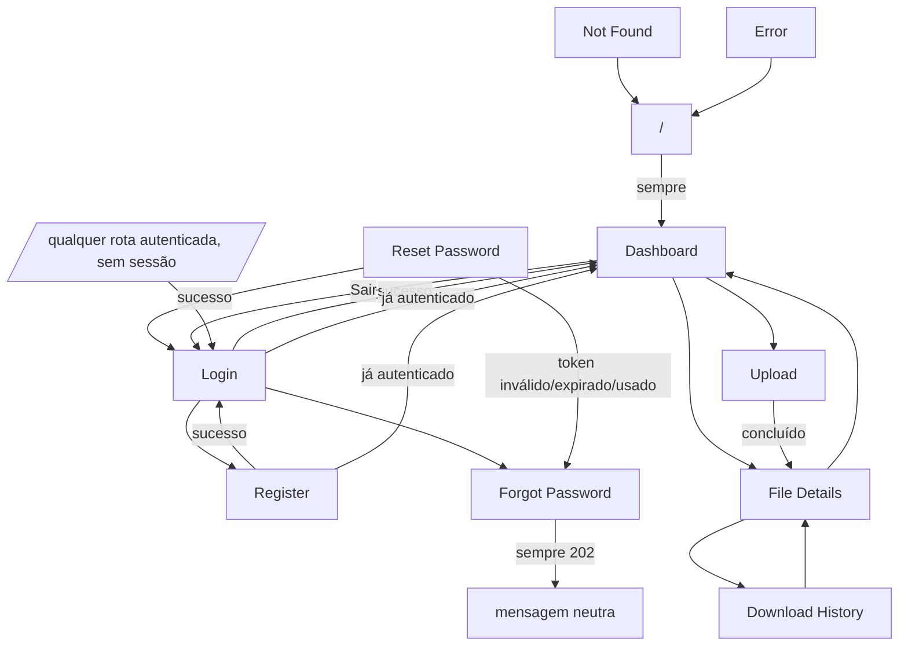

### Transition Matrix

| Origem | Ação | Condição | Destino |
| --- | --- | --- | --- |
| `/` | (carregamento) | sempre | Dashboard |
| Login | Entrar | sucesso | Dashboard |
| Login | Entrar | `AUTH_INVALID_CREDENTIALS` (401) | Login + erro |
| Login | Entrar | `RATE_LIMITED` (429) | Login + aviso |
| Login | Entrar | `INTERNAL_ERROR`/rede | Login + erro |
| Login | (carregar página) | já autenticado | Dashboard |
| Login | link "Cadastre-se" | sempre | Register |
| Login | link "Esqueci minha senha" | sempre | Forgot Password |
| Register | Cadastrar | sucesso | Login (após 1.5s) |
| Register | Cadastrar | `VALIDATION_ERROR` (400) | Register + erro |
| Register | Cadastrar | `AUTH_EMAIL_ALREADY_EXISTS` (409) | Register + erro |
| Register | (carregar página) | já autenticado | Dashboard |
| Register | link "Entrar" | sempre | Login |
| Forgot Password | Enviar instruções | sucesso (202, sempre, exista ou não o email) | mensagem neutra (mesma tela) |
| Forgot Password | Enviar instruções | `VALIDATION_ERROR` (400) | Forgot Password + erro |
| Forgot Password | Enviar instruções | `RATE_LIMITED` (429) | Forgot Password + aviso |
| Forgot Password | link "Voltar para o login" | sempre | Login |
| Reset Password | (carregar página) | token ausente na query | estado de erro (token inválido) |
| Reset Password | (validar token) | `AUTH_PASSWORD_RESET_INVALID` (404) | estado de erro: inválido |
| Reset Password | (validar token) | `AUTH_PASSWORD_RESET_EXPIRED` (410) | estado de erro: expirado |
| Reset Password | (validar token) | `AUTH_PASSWORD_RESET_USED` (410) | estado de erro: utilizado |
| Reset Password | Redefinir senha | sucesso | Login |
| Reset Password | Redefinir senha | `VALIDATION_ERROR` (400) | Reset Password + erro (mantém formulário) |
| Reset Password | Redefinir senha | `RATE_LIMITED` (429) | Reset Password + erro (mantém formulário) |
| Reset Password | Redefinir senha | token expira entre load e submit | estado de erro (mesmo tratamento do load) |
| Reset Password | link "Solicitar nova recuperação" (em qualquer estado de erro de token) | sempre | Forgot Password |
| Dashboard | Enviar arquivo | sempre | Upload |
| Dashboard | Ver detalhes (linha) | sempre | File Details |
| Dashboard | Gerar/Regenerar link (inline) | sucesso/erro | permanece no Dashboard (toast) |
| Dashboard | Ver histórico (inline, expandir) | sempre | permanece no Dashboard |
| Dashboard | Sair | sempre | Login |
| Upload | selecionar arquivo válido | sucesso (initiate→PUT→complete→link) | Completed (mesma tela) |
| Upload | selecionar arquivo | tipo não permitido / tamanho excedido | Idle + erro (nunca chama a Api) |
| Upload | (initiate) | `FILE_*`/`VALIDATION_ERROR` | Failed + erro |
| Upload | (PUT no S3) | falha de rede/URL expirada | Failed + erro genérico |
| Upload | (complete) | `FILE_UPLOAD_INVALID_STATE` (409) | Failed + erro |
| Upload | Cancelar | durante Uploading | Failed ("Envio cancelado.") |
| Upload | Ver detalhes (após concluído) | sempre | File Details |
| Upload | Enviar outro arquivo / Tentar novamente | sempre | Idle |
| File Details | (carregar) | arquivo não existe / não pertence ao usuário | NotFound (`FILE_NOT_FOUND`, 404) |
| File Details | (carregar) | `Status == Expired` ou `ExpiresAt` já passado | banner Expired (dados continuam visíveis) |
| File Details | Gerar/Regenerar link | sucesso | permanece (link exibido) |
| File Details | Gerar/Regenerar link | `FILE_EXPIRED` (409) / `FILE_UPLOAD_NOT_COMPLETED` (409) | permanece (toast de erro) |
| File Details | Ver histórico | sempre | Download History |
| File Details | Voltar | sempre | Dashboard |
| Download History | (carregar) | arquivo não existe / não pertence ao usuário | NotFound |
| Download History | (carregar histórico) | falha | erro + Tentar novamente |
| Download History | Voltar | sempre | File Details |
| qualquer rota com `[Authorize]` | (carregar) | sem sessão válida | Login (`RedirectToLogin`) |
| qualquer chamada autenticada | (resposta) | `401` a qualquer momento | Login (`SessionGuard`, após toast) |
| Not Found / Error | Voltar para o início | sempre | `/` → Dashboard/Login |

### Authentication

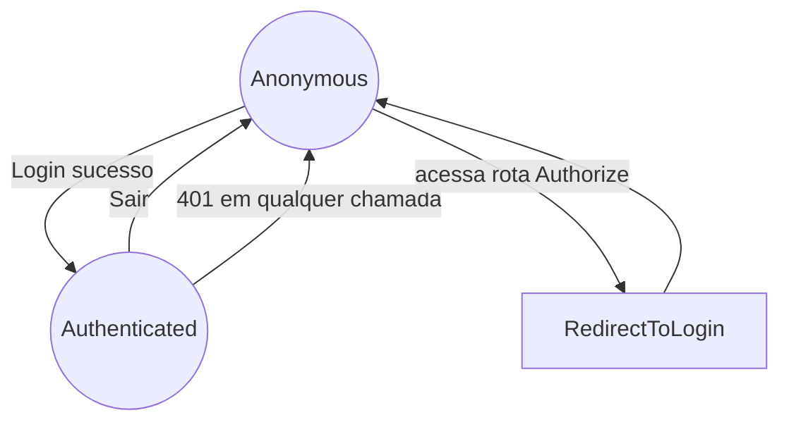

- Estado de sessão vive só em memória do circuito Blazor Server (`AuthTokenProvider`), nunca em
  `localStorage`/cookie — um hard refresh desloga o usuário por design (ver comentário da própria
  classe).
- `Logout` (MainLayout) segue exatamente a ordem exigida: desconecta SignalR
  (`NotificationService.StopAsync()`) → limpa token (`TokenProvider.Clear()`) → limpa estado de
  auth (`AuthStateProvider.MarkUserAsLoggedOut()`) → navega para `/login`.
  `SessionGuard` (reação a 401) faz a mesma ordem lógica, só que assíncrona (toast antes de
  navegar).
- Login/Register verificam `TokenProvider.IsAuthenticated` em `OnInitialized` e redirecionam para
  `/dashboard` sem nunca renderizar o formulário, se já autenticado.
- Browser back após logout: como cada nova navegação recria o `AuthenticationState` a partir do
  `AuthStateProvider` (já `MarkUserAsLoggedOut()`), `AuthorizeRouteView` bloqueia e redireciona
  novamente para `/login` mesmo dentro do mesmo circuito (sem precisar de um reload completo).

### Password Recovery

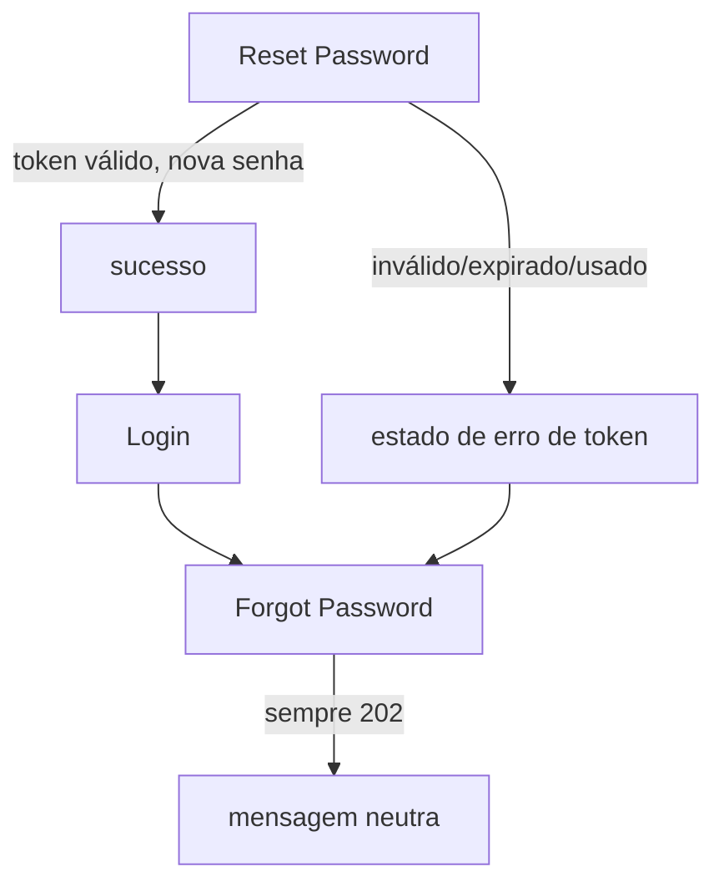

- Anti-enumeração: `ForgotPassword` sempre mostra a mesma mensagem de sucesso, exista ou não a
  conta — a Api já garante isso (`AuthController.ForgotPassword`, resposta 202 idêntica).
- `ResetPassword` decide qual mensagem mostrar **pelo `code`**, nunca pela mensagem crua do
  servidor (`MessageForCode` em `ResetPassword.razor`) — os três códigos
  (`AUTH_PASSWORD_RESET_INVALID/EXPIRED/USED`) têm textos fixos no cliente.

### File Management

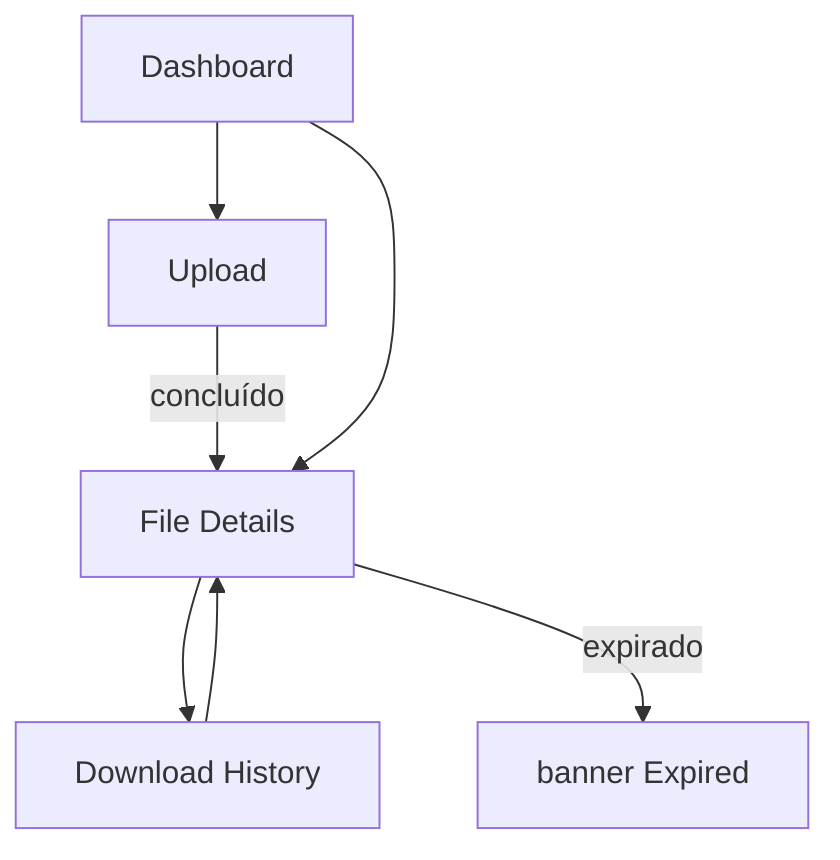

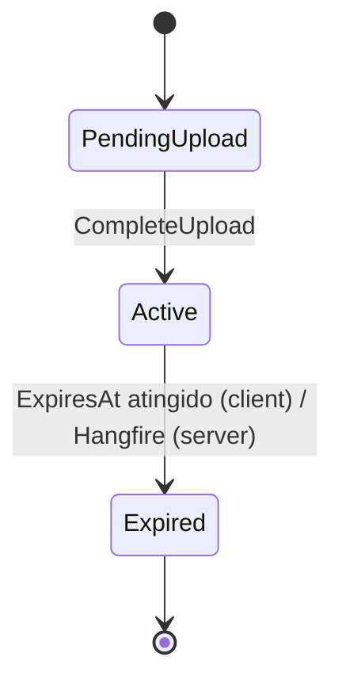

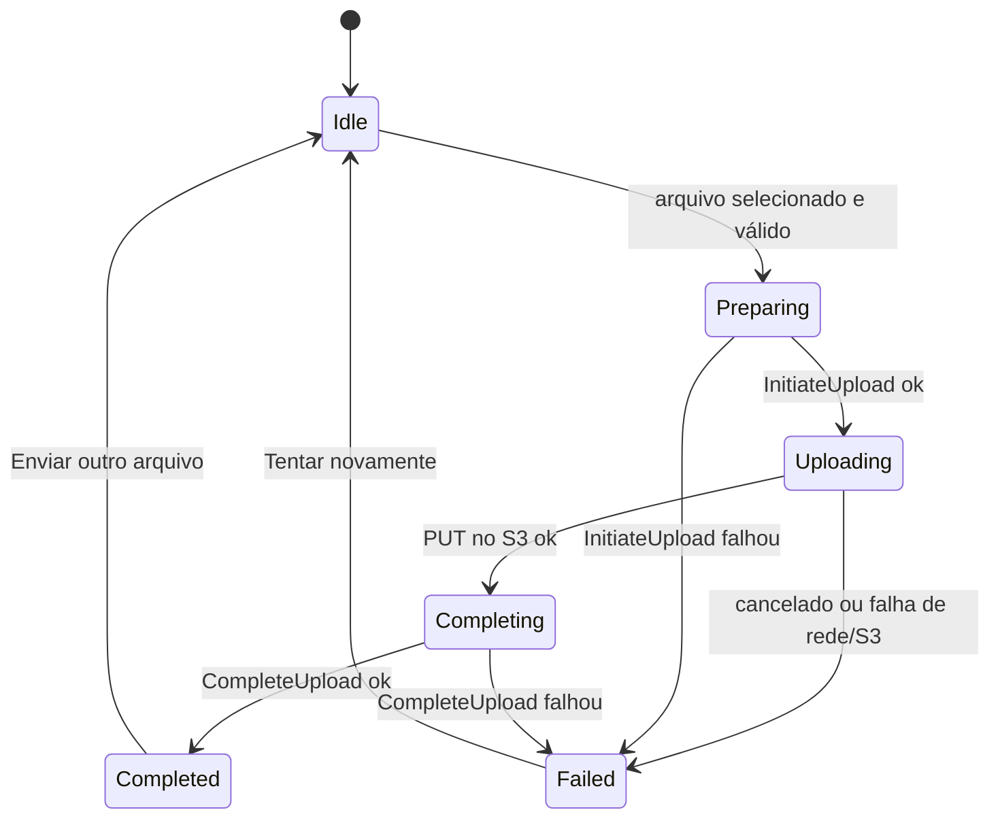

- **Regenerar link sempre invalida o anterior** — só o hash fica persistido (`File.AccessTokenHash`);
  não existe "recuperar" um token já emitido. `FileLinkCell` (compartilhado por Dashboard e File
  Details) sempre pede confirmação antes de regenerar um link já existente.
- **Countdown/estado "efetivamente expirado"** é só de exibição
  (`FileDisplayFormatting.IsEffectivelyExpired`) — o servidor sempre revalida `ExpiresAt`
  independente do que o cliente mostra.
- **Upload no navegador é uma feature real** (decisão desta fase — ver "Known Issues" sobre o
  limite de tamanho), reaproveitando exatamente os mesmos três endpoints que o app Mobile usa
  (`upload` → PUT presigned → `complete`), nunca um caminho paralelo.

### Error States

Um único componente reutilizável, `Shared/ErrorState.razor`, cobre todos os estados —
parametrizado por `Kind` (`Generic`, `Unauthorized`, `Forbidden`, `NotFound`, `Expired`,
`RateLimited`), cada um com sua própria mensagem/título/ação por página (nunca hardcoded no
componente). Usado hoje em: File Details (NotFound/Expired), Download History (NotFound), Not
Found (`/not-found`), Error (`/Error`).

`Unauthorized`/`Forbidden` existem como valores do enum para uso futuro consistente, mas não são
alcançados como uma tela renderizada hoje: 401 é tratado globalmente por `SessionGuard` (toast +
redirect, nunca uma página própria) e nenhuma rota atual devolve 403 (ver
`docs/api-errors.md` — `AuthorizationErrorCode.Forbidden` é reservado).

---

## Mobile

### Screen Inventory

| Tela | Rota (Shell) | Auth | Entradas | Ações | Destinos | Estados |
| --- | --- | --- | --- | --- | --- | --- |
| Login | `login` (raiz) | Não | email, senha | Entrar, ir p/ Registro, ir p/ Esqueci senha | `home` (raiz, sucesso) | Idle, Busy, Erro (credenciais/rate limit/inesperado) |
| Register | `register` | Não | email, senha, confirmação | Cadastrar, voltar p/ Login | volta p/ Login (sucesso, após 2s) | Idle, Busy, Erro (validação local + Api), Sucesso |
| Forgot Password | `forgotpassword` | Não | email **ou** "Já tenho um token" | Enviar instruções, ir para colar token | mensagem neutra / Reset Password (manual) | Idle, Busy, Sucesso (neutro), Erro |
| Reset Password | `resetpassword` | Não | token (colado manualmente), nova senha, confirmação | Validar token, Redefinir senha | volta p/ Login (raiz, sucesso) | ValidandoToken, TokenInválido/Expirado/Utilizado, Formulário, Busy, Sucesso |
| Home | `home` (raiz) | **Sim** | — | Atualizar (pull-to-refresh), Enviar arquivo, abrir File Details, Sair | `upload`, `filedetails`, `login` (raiz, logout) | Loading, Empty, Error, Success (com banner de notificação) |
| Upload | `upload` | **Sim** | arquivo **ou** pasta (zip automático) | Selecionar arquivo/pasta, Confirmar envio, Cancelar (durante envio), Copiar/Compartilhar link, Concluir | volta (Concluir) | Idle, Preparing, Uploading, Completing, Completed, Failed |
| File Details | `filedetails?fileId=` | **Sim** | — | Gerar/Regenerar link, Copiar, Compartilhar, Ver histórico, Fechar | `history`, volta | Loaded, Erro (toast) |
| History | `history?fileId=` | **Sim** | — | Tentar novamente (em erro) | volta | Loading, Empty, Error, Success |

Componentes/serviços compartilhados (não são telas): `AppShell` (chrome único, sem flyout/tabs),
`INavigationService` (abstração sobre `Shell.Current.GoToAsync`), `INotificationService`/
`SignalRNotificationService` (mesmo hub do Web), `FileCard` (item de lista reutilizado por Home).

### Navigation Graph

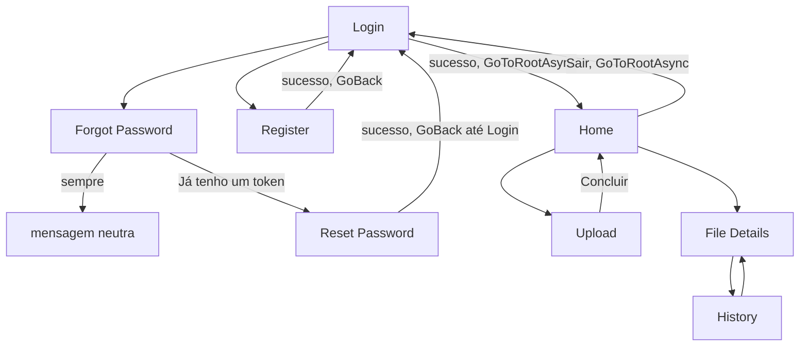

### Transition Matrix

| Origem | Ação | Condição | Destino |
| --- | --- | --- | --- |
| Login | Entrar | sucesso | Home (`GoToRootAsync("//home")` — stack limpa) |
| Login | Entrar | `AUTH_INVALID_CREDENTIALS` (401) | Login + erro |
| Login | Entrar | `RATE_LIMITED` (429) / `INTERNAL_ERROR` | Login + erro (mensagem da Api) |
| Login | "Cadastre-se" | sempre | Register (push) |
| Login | "Esqueci minha senha" | sempre | Forgot Password (push) |
| Register | Cadastrar | sucesso | Login (`GoBackAsync`, após 2s) |
| Register | Cadastrar | validação local / `VALIDATION_ERROR` / `AUTH_EMAIL_ALREADY_EXISTS` | Register + erro |
| Register | "Entrar" | sempre | Login (`GoBackAsync`) |
| Forgot Password | Enviar instruções | sucesso (sempre) | mensagem neutra |
| Forgot Password | "Já tenho um token" | sempre | Reset Password (modo colar token) |
| Reset Password | Validar token | inválido/expirado/usado | estado de erro correspondente |
| Reset Password | Redefinir senha | sucesso | Login (`GoBackAsync` até a raiz de Login) |
| Reset Password | Redefinir senha | erro | permanece no formulário |
| Home | (carregar) | sucesso | lista de arquivos |
| Home | (carregar) | falha | Error + Tentar novamente |
| Home | pull-to-refresh | sempre | recarrega lista |
| Home | Enviar arquivo | sempre | Upload |
| Home | tocar em um arquivo | sempre | File Details |
| Home | Sair | sempre | Login (`GoToRootAsync("//login")` — stack limpa) |
| Home | (SignalR `FileDownloaded`) | download de um arquivo próprio | banner + contador atualizado in-place |
| Upload | selecionar arquivo/pasta | sucesso | preview antes de confirmar |
| Upload | Confirmar envio | sucesso (initiate→PUT→complete→link) | Completed |
| Upload | Confirmar envio | falha em qualquer etapa | Failed + erro (nunca retry automático) |
| Upload | Cancelar | durante Uploading | Failed ("Envio cancelado.") |
| Upload | Concluir | sempre | volta para Home |
| File Details | Gerar/Regenerar link | sucesso/erro | permanece (link ou erro exibido) |
| File Details | Ver histórico | sempre | History |
| File Details | Fechar | sempre | volta para Home |
| History | (carregar) | falha | Error + Tentar novamente |

### Authentication

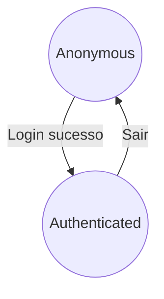

- `GoToRootAsync` substitui toda a pilha de navegação — usado tanto no login (para Home) quanto
  no logout (para Login) — impedindo "voltar" para uma tela autenticada depois do logout, ou para
  a tela de Login depois de já autenticado.
- `LogoutAsync` (HomeViewModel) segue a ordem: `_notificationService.StopAsync()` →
  `_authSession.ClearSession()` → limpa lista local → `GoToRootAsync("//login")`.

### Password Recovery

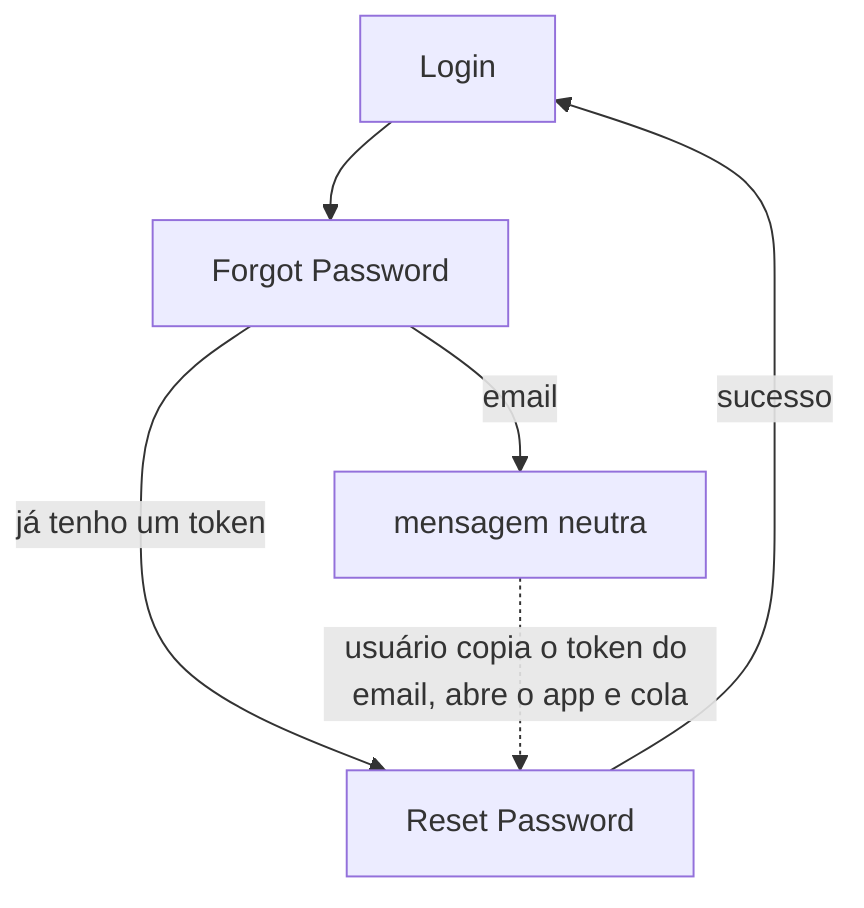

- **Sem deep link/App Link** (fora de escopo desta fase e da anterior) — o token chega por
  colagem manual: o usuário recebe o link por e-mail (aberto fora do app, no navegador ou cliente
  de e-mail), copia o token, volta ao app e cola em Reset Password. Ver "Known Issues".

### File Management

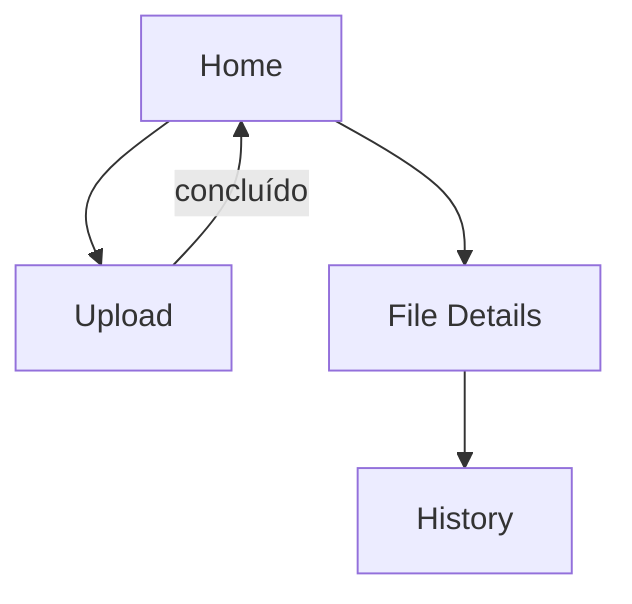

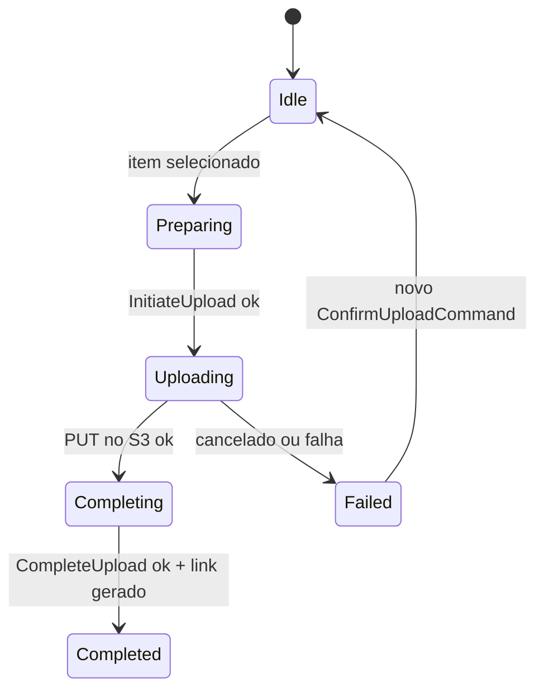

- Upload Mobile suporta **pasta** (compactada em zip no dispositivo antes do envio,
  `IFolderPickerService.PickFolderAndZipAsync`) — capacidade que o Upload Web não replica nesta
  fase (ver Known Issues).
- Progresso real por bytes (`ProgressReportingStream`), igual em espírito ao Upload Web.

### Notifications

```mermaid
flowchart TD
    Download[download público bem-sucedido] --> SignalR
    SignalR -->|FileDownloaded, User(ownerId)| App[app do dono, se conectado]
    App --> Banner[banner in-app + contador atualizado]
```

- Reconexão automática: `SignalRNotificationService` usa `.WithAutomaticReconnect()` (mesmo
  mecanismo do Web).
- Uma única conexão por sessão: `HomeViewModel` é singleton (um Home por sessão de app) e assina
  `_notificationService.FileDownloaded` uma vez; `StartAsync` é idempotente (no-op se já
  conectado).
- Logout desconecta (`StopAsync`) antes de limpar a sessão — nenhuma notificação pode chegar após
  o logout.
- Nenhum listener duplicado: o app nunca chama `StartAsync` mais de uma vez por sessão viva
  (chamado só em `LoginViewModel.LoginAsync` após sucesso).

### Error States

Mobile não usa um componente de erro único (diferente do Web) — cada tela já tinha seu próprio
estado de erro com ação de retry antes desta fase (`HasError`/`Tentar novamente` em Home e
History; `ErrorMessage` inline em Login/Register/Forgot/Reset/Upload/File Details), e essa
consistência já satisfaz "todo erro tem uma ação útil" sem precisar de uma nova abstração
compartilhada — introduzir uma agora só para espelhar o Web seria a abstração desnecessária que a
Etapa 17 pede para evitar.

---

## Cross-platform Flows

Web e Mobile **não compartilham sessão nem estado** (dois clients JWT independentes,
`AuthTokenProvider`/`AuthSession` cada um com o seu) — os fluxos abaixo são paralelos, nunca
sincronizados em tempo real entre plataformas, exceto pelo que já passa pelo backend:

- Um link público gerado no Web funciona no Mobile e vice-versa (mesmo endpoint,
  `POST /api/files/{id}/link`).
- Um download de qualquer plataforma (ou de um terceiro sem conta) dispara SignalR para **ambos**
  os clients do dono, se ambos estiverem conectados (`Clients.User(ownerId)` alcança todas as
  conexões daquele usuário — ver `docs/architecture.md`).
- Recuperação de senha: o e-mail (gerado por `DevelopmentEmailService`) sempre contém um link
  apontando para o **Web** (`PasswordReset:WebResetUrlBase`) — o Mobile nunca gera esse e-mail;
  seu fluxo de reset é alcançado só pelo botão "Esqueci minha senha" dentro do próprio app ou por
  colar manualmente o token recebido nesse e-mail.
- Upload: Web (até 200 MB, só arquivo único) e Mobile (até 5 GiB, arquivo ou pasta) usam
  exatamente os mesmos três endpoints (`upload`/PUT presigned/`complete`) — nenhuma lógica de
  servidor é exclusiva de uma plataforma.

---

## Error Code Mapping

Somente códigos com um site de `throw` real hoje (ver `docs/api-errors.md` para o catálogo
completo, incluindo os "reservados").

| Error Code | HTTP | Tela(s) | Estado | Ação |
| --- | ---: | --- | --- | --- |
| `AUTH_INVALID_CREDENTIALS` | 401 | Login (Web/Mobile) | erro | tentar novamente (mesmo formulário) |
| `AUTH_EMAIL_ALREADY_EXISTS` | 409 | Register (Web/Mobile) | erro | tentar novamente com outro email |
| `AUTH_PASSWORD_RESET_INVALID` | 404 | Reset Password (Web/Mobile) | token inválido | solicitar novo reset (Forgot Password) |
| `AUTH_PASSWORD_RESET_EXPIRED` | 410 | Reset Password (Web/Mobile) | token expirado | solicitar novo reset |
| `AUTH_PASSWORD_RESET_USED` | 410 | Reset Password (Web/Mobile) | token já utilizado | solicitar novo reset |
| `VALIDATION_ERROR` | 400 | Login/Register/Forgot/Reset/Upload (qualquer formulário) | erro de validação | corrigir os campos apontados |
| `FILE_NOT_FOUND` | 404 | File Details, Download History (Web) | not found | voltar para o Dashboard |
| `FILE_EXPIRED` | 409 | File Details (Web/Mobile, ao gerar link) | expirado | nenhuma (link não pode mais ser gerado; arquivo continua visível) |
| `FILE_UPLOAD_INVALID_STATE` | 409 | Upload (Web/Mobile) | falha ao concluir upload | tentar novamente (novo envio do zero) |
| `FILE_UPLOAD_NOT_COMPLETED` | 409 | File Details (Web/Mobile, ao gerar link antes do upload terminar) | link indisponível | aguardar conclusão do upload |
| `RATE_LIMITED` | 429 | Login, Forgot Password (Web/Mobile); rotas públicas de arquivo | limitado | aguardar e tentar novamente |
| `INTERNAL_ERROR` | 500 | qualquer tela que chama a Api | erro inesperado | tentar novamente / voltar |

Diferença notável em relação ao exemplo do enunciado da tarefa: `FILE_EXPIRED` é **409**, não
404, porque o único site de `throw` real hoje é `FilePublicLinkService.GenerateLinkAsync`
("não é possível gerar link para arquivo expirado" — uma operação recusada dado o estado atual,
não um recurso ausente). O 404 genérico de arquivo é sempre `FILE_NOT_FOUND`.

---

## Known Issues

- **Upload Web tem um teto de 200 MB**, bem abaixo do limite de 5 GiB do backend
  (`FileStorageOptions.MaxFileSizeBytes`, usado sem alteração pelo Mobile). Motivo: Blazor Server
  não tem um caminho navegador→S3 direto sem CORS no bucket (fora de escopo desta fase — mudança
  de infraestrutura); todo byte do Upload Web passa pelo circuito SignalR até este processo
  servidor antes do PUT para o S3. Aumentar esse teto exigiria ou configurar CORS no bucket
  (mudança de infra) ou aceitar uma transferência mais lenta pelo circuito — nenhuma das duas foi
  necessária para o objetivo desta fase (navegação).
- **Upload Web não suporta pasta/zip** — o Mobile compacta a pasta no dispositivo antes de
  enviar; replicar isso no navegador exigiria uma biblioteca de zip client-side, fora do escopo
  de uma tarefa de navegação.
- **Sem teste bUnit dedicado para o limite de tamanho do Upload** — cobri-lo exigiria alocar
  >200 MB por execução de teste; a lógica é um comparador direto (`file.Size > MaxUploadSizeBytes`),
  simétrica à validação de Content-Type, que **é** testada.
- **Deep Link/Android App Link continua fora de escopo** (decisão de fases anteriores, reafirmada
  nesta tarefa) — Reset Password no Mobile depende de colagem manual do token.
- **Revogação de JWT após reset de senha continua fora de escopo** (decisão deliberada,
  documentada desde a fase de recuperação de senha) — um JWT emitido antes do reset continua
  válido até expirar naturalmente.
- **Sem endpoint de arquivo único** (`GET /api/files/{id}`) — File Details e Download History
  (Web) reaproveitam `GET /api/files/mine` e filtram pelo id no cliente, já que a lista inteira
  já é ownership-checked no servidor; criar um endpoint dedicado é possível no futuro sem quebrar
  nada, mas não era necessário para esta fase.
- **`AuthorizationErrorCode.Forbidden` (403) continua reservado** — nenhuma rota atual distingue
  "autenticado mas sem permissão" de "recurso não encontrado"; ownership sempre responde 404
  genérico (ver `docs/security.md`).

## Future Improvements

- Upload Web direto navegador→S3 (exigiria CORS no bucket) para remover o teto de 200 MB.
- Suporte a pasta/zip no Upload Web.
- Deep Link/Android App Link para abrir Reset Password diretamente do e-mail.
- Endpoint dedicado `GET /api/files/{id}` se o cliente algum dia precisar de mais dados por
  arquivo do que a listagem completa já traz.
- Tela dedicada de "conta/configurações" — não existe hoje em nenhuma das duas plataformas (não
  criada nesta fase por não haver nenhuma funcionalidade de conta além de sessão/logout para
  preencher essa tela — ver Etapa 17, "não crie funcionalidades apenas para preencher a tela").

## Implementation Rules

Regras derivadas do código implementado — uma sessão futura do Claude Code deve segui-las ao
mexer em navegação/telas deste projeto:

- Authenticated users cannot access Login/Register unnecessarily — ambas checam
  `TokenProvider.IsAuthenticated` (Web) / nunca são a tela inicial pós-login (Mobile, via
  `GoToRootAsync`) e redirecionam para o Dashboard/Home.
- Logout disconnects SignalR before/alongside clearing authentication state, sempre nesta ordem:
  `NotificationService.StopAsync()` → limpar token → limpar estado de auth → navegar.
- `GoToRootAsync`/redirecionamento pós-logout deve sempre substituir a pilha de navegação inteira
  (Mobile: `Shell.Current.GoToAsync("//login")`; Web: uma nova navegação sempre reavalia
  `AuthenticationState` a partir do zero) — nunca deixar uma tela autenticada alcançável pelo
  botão "voltar".
- Password reset success redirects to Login, nunca autentica automaticamente o usuário.
- Password reset errors sempre oferecem um caminho para `Forgot Password` (nunca terminam num
  beco sem saída) — decidido pelo `code`, nunca pela mensagem crua do servidor, porque
  `EXPIRED`/`USED` compartilham o mesmo HTTP status (410).
- Public file expiration/anti-enumeration nunca revela existência prévia — todo motivo de falha
  numa rota pública (`GetPublicFile`/`DownloadPublicFile`) produz exatamente a mesma exceção
  (`ResourceNotFoundException(FileErrorCode.NotFound, "Arquivo não disponível.")`).
- Every recoverable error provides an actionable UI state — nunca um alerta sem botão/link
  quando existe algo útil a fazer (retry, voltar, novo reset). Ver Known Issues para os únicos
  dois casos que tinham essa lacuna antes desta fase (`/Error`, `/not-found`), corrigidos aqui.
  Usar `Shared/ErrorState.razor` (Web) para qualquer novo estado desse tipo, em vez de markup de
  alerta ad-hoc.
- File Details/Dashboard/Home refletem sempre o `ExpiresAt`/`Status` vindos da Api — nenhum
  cálculo local pode autorizar/negar uma ação (gerar link, download); o "efetivamente expirado"
  do cliente é só cosmético, a Api sempre revalida.
- SignalR notifications update the relevant UI in-place (contador de downloads, banner de toast)
  sem exigir reload completo da tela — em ambas as plataformas.
- Regenerar um link público exige confirmação explícita quando já existe um link (`FileLinkCell`
  no Web, `ShowRegenerateConfirm` no Mobile) — nunca invalidar um link em uso sem essa etapa.
- Novos endpoints não são a resposta padrão para uma tela de navegação — reaproveite dados já
  expostos (ex.: File Details/History reaproveitando `GetMyFilesAsync`) quando o ownership já é
  garantido pelo endpoint existente, antes de propor um endpoint novo.
- Download history nunca expõe IP/user-agent ao cliente, em nenhuma das duas plataformas — isso é
  uma decisão de produto herdada (`DownloadHistoryEntryResponse` só tem `DownloadedAt`), não algo
  a "corrigir" adicionando os campos de volta.
